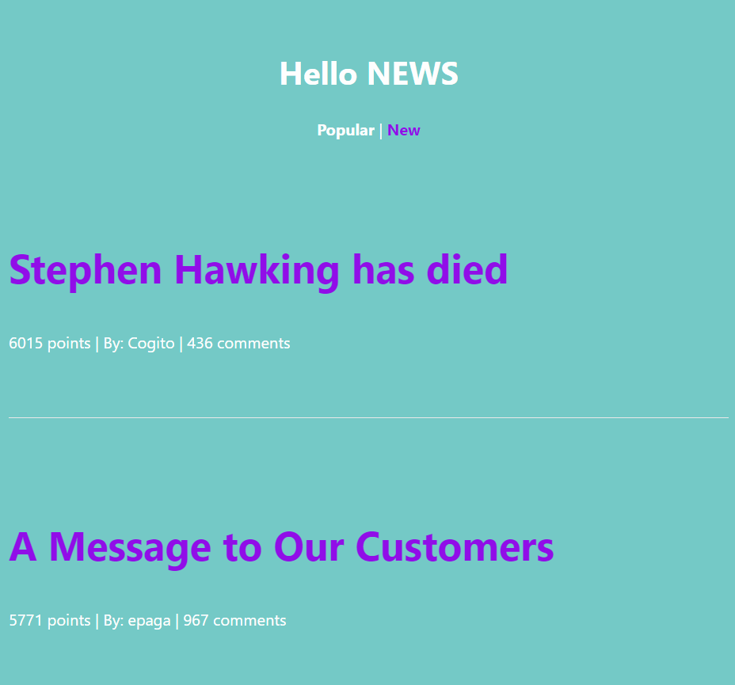
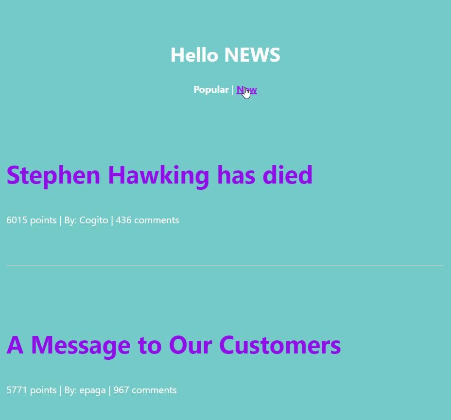

# Hello NEWS
Hacker NEWS API를 이용해 뉴스를 popular/new 순으로 정렬해 출력
```
- popular (인기순) : http://hn.algolia.com/api/v1/search?tags=story
- new (최신순) : http://hn.algolia.com/api/v1/search_by_date?tags=story
```
<br>

- api 데이터
  


<br>

## 개발환경
```
repl.it
```  
<br>

## 실행화면
  1. popular 화면(메인 화면)
    


<br>

  2. new 화면

